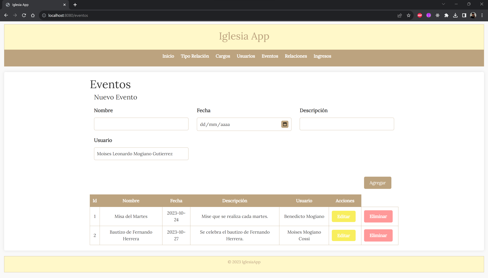

# Application Web de Gestion d'Église

Bienvenue dans le référentiel de l'Application Web de Gestion d'Église. Cette application web est conçue pour aider à gérer divers aspects de l'administration d'églises, y compris la gestion des utilisateurs, des événements, le suivi des revenus et la gestion des rôles. Elle suit le modèle architectural Modèle-Vue-Contrôleur (MVC) pour un code structuré et facile à maintenir.

[English](./README.md) | [Español](./README.es.md) | [Français](./README.fr.md) | [日本語](./README.jp.md)

## Caractéristiques

- **Gestion des Utilisateurs :** Créez et gérez des comptes d'utilisateurs pour les membres et le personnel de l'église.

- **Gestion des Événements :** Programmez et gérez les événements de l'église, y compris les services, les réunions et les occasions spéciales.

- **Suivi des Revenus :** Enregistrez et suivez les revenus de l'église, y compris les dîmes, les offrandes et les dons.

- **Gestion des Rôles :** Attribuez des rôles aux membres de l'église, tels que pasteur, diacre et ancien.

- **Gestion des Relations :** Enregistrez et suivez les relations entre les membres de l'église, tels que la famille, les amis et les collègues.

## Structure du Projet

Le projet est structuré en suivant le modèle MVC :

- **Modèle :** Contient les interactions avec la base de données, la logique métier et les modèles de données.

- **Vue :** Inclut la couche de présentation responsable du rendu HTML et des interfaces utilisateur.

- **Contrôleur :** Gère la logique centrale de l'application, traite les demandes et orchestre le flux de données.

- **Public :** Stocke les actifs publics tels que CSS, JavaScript et images.

- **Config :** Fichiers de configuration pour les connexions à la base de données et autres paramètres.

- **Base de Données :** Contient des scripts SQL pour créer et peupler la base de données.

## Installation

1. Clonez ce référentiel dans le répertoire de votre serveur web :

    ```bash
    https://github.com/LeoMogiano/arqui_project.git
    ```

2. Installez XAMPP ou WAMP pour exécuter l'application en local.

3. Configurez la connexion à la base de données dans les fichiers `config/database.php` et `models/IglesiaDB.php`.

4. Lancez le serveur et ouvrez l'application dans votre navigateur.

    ```bash
    php -S localhost:8080 -t public
    ```

## Captures d'Écran

*Écran*

<p align="center">
  
</p>

## Contribution

Les contributions sont les bienvenues ! Si vous souhaitez contribuer à ce projet, bifurquez le référentiel, apportez vos modifications et soumettez une demande pull.

## Licence

Ce projet est open source et disponible sous la [Licence MIT](LICENSE). Vous êtes libre de l'utiliser et de le modifier selon vos besoins en gestion d'églises.

## Contact

Si vous avez des questions ou avez besoin d'aide, n'hésitez pas à nous contacter.

Profitez de l'utilisation de l'Application Web de Gestion d'Église !
